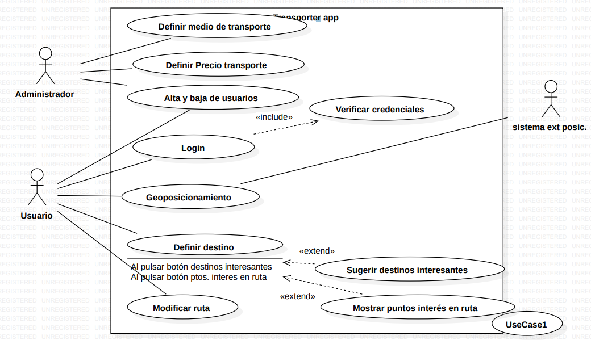

## Actor

|  Actor | Administrador |
|---|---|
| Descripción  | El actor  encargado de mantener Todo funcionando   |
| Características  | Muestra la aptitud para administrar usuarios, controlar el acceso a funciones administrativas y la capacidad de definir y gestionar la información almacenada en la aplicación. |
| Relaciones | Tiene relaciones con el actor usuario durante alta y baja de usuarios |
| Referencias | Definir medio de transporte,Definir precio de transporte y alta y baja de usuarios |   
|  Notas |  Los administradore normalmente son persona que tiene un gran conocimiento tecnicos.  |
| Autor  | Joseph Vanegas Caicedo |
|Fecha | 30/01/2024 |

## Caso de Uso 

|  Caso de Uso	CU | Definir medio de transport  |
  |---|---|
  | Fuentes  | app transporte.pdf  |
  | Actor  |  Administrador |
  | Descripción | Permite al administrador cambiar el medio de transporte  |
  | Flujo básico | 1.El administrador incia sesion 2 el administrador se va al apartado de trasnporte 3. El administrador cambia el medio de transporte|
  | Pre-condiciones | El administrador debe ingreasar en la cuenta de administrador  |  
  | Post-condiciones  | el nuevo medio de transporte se registra y estara disponible  |  
  |  Requerimientos | El administrador tiene que tener permisos para editar los medios de transporte  |
  | Autor  |  Joseph Vanegas Caicedo |
  |Fecha | 31/01/2024 |

