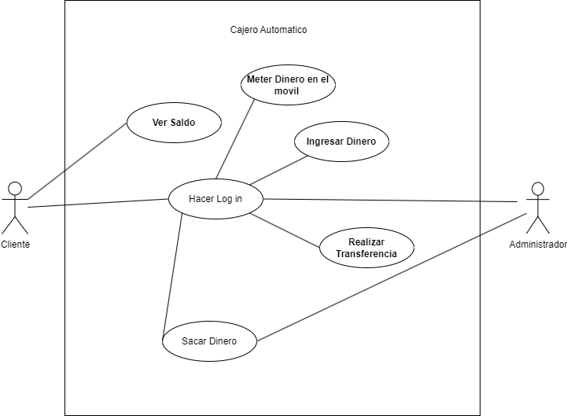

Actor	|Sistema Administrativo del Cajero
|---|---|
Descripción|	El sistema administrativo del banco es una entidad encargada de gestionar la aplicación del diagrama de casos de uso y controlar el sistema relacionado con las operaciones bancarias.
Características	| Capacidad para gestionar cajeros automáticos. - Acceso a funciones administrativas. - Habilidad para definir y manejar la información contenida en la aplicación bancaria específica para cajeros automáticos.
Relaciones|	Mantiene relaciones con el Cliente bancario al interactuar y realizar operaciones, y mantiene relación con el sistema bancario general y la base de datos.
Referencias|	Realiza acciones relacionadas con la administración del sistema de cajeros automáticos, como gestionar transacciones con los clientes.
Notas|	Es una entidad de software dentro del sistema bancario, encargada de la gestión automatizada de los cajeros automáticos. No se trata de una persona física en este caso.
| Autor  | Joseph Vanegas Caicedo |
|Fecha | 30/01/2024 |

Actor	|Cliente Bancario
|---|---|
Descripción|	El cliente bancario es un usuario que utiliza los servicios proporcionados por el sistema bancario, como realizar transacciones, consultar saldos y gestionar su cuenta.
Características|	- Capacidad para realizar operaciones bancarias, como retiros, depósitos, transferencias y consultar saldos.
Relaciones|	Mantiene relaciones con el Sistema Bancario para realizar operaciones y gestionar su cuenta.
Referencias|	Realiza acciones relacionadas con la utilización de servicios bancarios, como "Realizar Transferencia", "Consultar Saldo", "Poner dinero en el móvil" o "Ingresar Dinero".
Notas|	El cliente bancario es un usuario registrado en el sistema bancario y puede interactuar con los servicios a través de cajeros automáticos o aplicaciones móviles/online.
| Autor  | Joseph Vanegas Caicedo |
|Fecha | 30/01/2024 |

Caso de Uso	| Hacer Login
|---|---|
Actor	|Cliente Bancario
Descripción|	El cliente debe ser autenticado en la cuenta bancaria con su tarjeta y contraseña.
Flujo básico|	Paso 1	El cliente ingresa la tarjeta. 2	Ingresa la contraseña Flujo alternativo	Paso 1	En caso de que la contraseña ingresada sea incorrecta   .1	Se cierra el caso de uso.
Pre-condiciones	|El cliente debe estar registrado con una cuenta bancaria.
Post-condiciones|	El cliente ingresa al menú de opciones disponibles para realizar en el cajero.
| Autor  | Joseph Vanegas Caicedo |
|Fecha | 30/01/2024 |

Caso de Uso	|Realizar Transferencia
|---|---|
Actor	|Cliente Bancario
Descripción	|El cliente realiza una transferencia de fondos a otra cuenta, ya sea interna o externa al banco.
Flujo básico|	Paso 1	El cliente selecciona la opción "Realizar Transferencia" en el menú. 2	Ingresa los detalles de la cuenta de destino (número de cuenta, nombre del beneficiario).3	Especifica la cantidad a transferir.4	Confirma la transacción con su contraseña.
Flujo alternativo|	Paso1	Si la cuenta de destino no existe...A.1	Se muestra un mensaje de error y se cierra el caso de uso.2	Si la cantidad supera el límite diario de transferencia...A.1	Se muestra un mensaje de error y se cierra el caso de uso.
Pre-condiciones	|El cliente debe haber iniciado sesión en su cuenta bancaria.
Post-condiciones|	Se realiza la transferencia de fondos y se actualiza el saldo de ambas cuentas.
Requerimientos|	La cuenta de destino puede ser interna o externa al banco, y se deben cumplir las políticas de seguridad establecidas por el banco.
| Autor  | Joseph Vanegas Caicedo |
|Fecha | 30/01/2024 |

Caso de Uso	|Ver Saldo
|---|---|
Actor	|Cliente Bancario
Descripción|	El cliente verifica el saldo disponible en su cuenta bancaria.
Flujo básico|	Paso 1	El cliente selecciona la opción "Ver Saldo" en el menú.2	El sistema muestra el saldo actual de la cuenta.
Flujo alternativo|	N/A
Pre-condiciones	|El cliente debe haber iniciado sesión en su cuenta bancaria.
Post-condiciones|	El cliente visualiza el saldo de su cuenta.
| Autor  | Joseph Vanegas Caicedo |
|Fecha | 30/01/2024 |

Caso de Uso|	Ingresar Dinero
|---|---|
Actor	|Cliente Bancario
Descripción|	El cliente deposita dinero en efectivo en su cuenta bancaria a través del cajero automático.
Flujo básico|	Paso1	El cliente selecciona la opción "Ingresar Dinero" en el menú.2	Ingresa la cantidad de dinero a depositar.3	Introduce el dinero en el cajero automático.
Flujo alternativo|	N/A
Pre-condiciones|	El cliente debe haber iniciado sesión en su cuenta bancaria.
Post-condiciones|	Se deposita el dinero en la cuenta del cliente y se actualiza el saldo.
Requerimientos|	El cajero automático debe aceptar depósitos en efectivo.
| Autor  | Joseph Vanegas Caicedo |
|Fecha | 30/01/2024 |

Caso de Uso|	Sacar Dinero
|---|---|
Actor	Cliente| Bancario
Descripción|	El cliente retira dinero en efectivo de su cuenta bancaria a través del cajero automático.
Flujo básico|	Paso 1	El cliente selecciona la opción "Sacar Dinero" en el menú.2	Ingresa la cantidad de dinero a retirar.3	Confirma la transacción con su contraseña.4	El cajero dispensa el dinero solicitado.
Flujo alternativo|	Paso 1	Si el monto solicitado supera el límite diario de retiro... A.1	Se muestra un mensaje de error y se cierra el caso de uso.
Pre-condiciones|	El cliente debe haber iniciado sesión en su cuenta bancaria.
Post-condiciones|	Se retira el dinero de la cuenta del cliente y se actualiza el saldo.
Requerimientos|	El cajero automático debe contar con suficiente efectivo y el cliente debe tener saldo suficiente.
| Autor  | Joseph Vanegas Caicedo |
|Fecha | 30/01/2024 |
