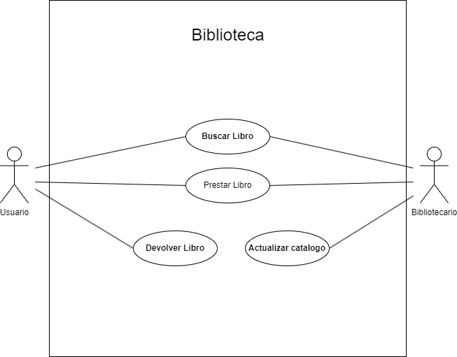

|  Actor | Usuario |
|---|---|
| Descripción  | El usuario utiliza el sistema de la biblioteca para buscar,prestar y devolver libros  |
| Características  | Pueden buscar diferentes libros basado en parametros como genero. |
| Relaciones | Tiene dos relaciones con el actor bibliotecario y son Buscar libro y prestar libro.  |
| Referencias | Buscar libro,Prestar Libro,Devolver libro |   
| Autor  | Joseph Vanegas Caicedo |
|Fecha | 31/01/2024 |

|  Actor | Bibliotecario |
|---|---|
| Descripción  | Manejar el sistema de libros y actualizar el catalogo cuando un libro sea prestado  |
| Características  | Muesta la aptutud para administar los libros y manejar que libro es prestado.  |
| Relaciones | Tiene dos realaciones con el actor usuario que son prestar libro y buscar libro  |
| Referencias | Buscar libro,Prestar libro,Actualizar catalogo |   
|  Notas |  Tiene que tener un conocimiento de los libros y de como actualizar el catalogo |
| Autor  | Joseph Vanegas Caicedo |
|Fecha | 31/01/2024 |

|  Caso de Uso	CU | Buscar libro  |
  |---|---|
  | Fuentes  | Jpexposito repositorio |
  | Actor  |  Usuario,Bibliotecario |
  | Descripción | El usuario o bibliotecario busca un libro en el catalogo  |
  | Flujo básico | 1.El usuaria va a el catalogo y pone el nombre del libro o un filtro. 2.El sistema devuelve la informacion que el usuario quiere |
  | Pre-condiciones | El usuario tiene que tener algo en mente que quiera leer o buscar para leer  |  
  | Post-condiciones  | Lo libros que se an buscado son  prestados  |  
  |  Requerimientos | el usuaria tiene que tener acceso al los libros que estan disponibles.  |
  |  Notas |  El sisteam hace busquedas avanzadas por criterios. |
| Autor  | Joseph Vanegas Caicedo |
|Fecha | 31/01/2024 |
  
  |  Caso de Uso	CU | prestar Libro  |
  |---|---|
  | Fuentes  | Jpexposito repositorio  |
  | Actor  |  Usuario,Bibliotecario |
  | Descripción | _Descripción del caso de uso_  |
  | Flujo básico | _Descripción paso a paso de la ejecución. (1->2->3.)_ |
  | Pre-condiciones | _Que debe ocurrir con anterioridad_  |  
  | Post-condiciones  | _Que debe ocurrir con posterioridad_  |  
  |  Requerimientos | _Que debe de exister para que el caso de uso se ejecute. Ej: Tarjeta de crédito_  |
  |  Notas |  _Notas adicionales_ |
  | Autor  | Joseph Vanegas Caicedo |
|Fecha | 31/01/2024 |

  |  Caso de Uso	CU | XXX  |
  |---|---|
  | Fuentes  | _Documento que sustenta el caso de uso_  |
  | Actor  |  _Actores que participan en el caso de uso_ |
  | Descripción | _Descripción del caso de uso_  |
  | Flujo básico | _Descripción paso a paso de la ejecución. (1->2->3.)_ |
  | Pre-condiciones | _Que debe ocurrir con anterioridad_  |  
  | Post-condiciones  | _Que debe ocurrir con posterioridad_  |  
  |  Requerimientos | _Que debe de exister para que el caso de uso se ejecute. Ej: Tarjeta de crédito_  |
  |  Notas |  _Notas adicionales_ |
  | Autor  | Joseph Vanegas Caicedo |
|Fecha | 31/01/2024 |

  |  Caso de Uso	CU | XXX  |
  |---|---|
  | Fuentes  | _Documento que sustenta el caso de uso_  |
  | Actor  |  _Actores que participan en el caso de uso_ |
  | Descripción | _Descripción del caso de uso_  |
  | Flujo básico | _Descripción paso a paso de la ejecución. (1->2->3.)_ |
  | Pre-condiciones | _Que debe ocurrir con anterioridad_  |  
  | Post-condiciones  | _Que debe ocurrir con posterioridad_  |  
  |  Requerimientos | _Que debe de exister para que el caso de uso se ejecute. Ej: Tarjeta de crédito_  |
  |  Notas |  _Notas adicionales_ |
  | Autor  | Joseph Vanegas Caicedo |
|Fecha | 31/01/2024 |

