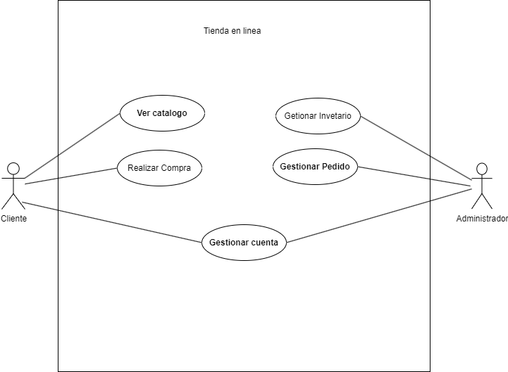

| Autor  | Joseph Vanegas Caicedo |
|Fecha | 30/01/2024 |

## Actores
|Actor|	Cliente|
|---|---|
|Descripción|	Persona que utiliza el sistema de gestión de la tienda en línea para explorar productos y realizar compras.|
|Características	| Puede ver el catálogo de productos.  - Puede realizar compras.  Tiene una cuenta con información de pago.|
|Relaciones|	Realiza acciones similares al “Administrador” al explorar |productos, pero no tiene acceso a la gestión del inventario.|
|Referencias|	Ver Catálogo, Realizar Compra, Gestionar Cuenta|
|Notas|	 Puede tener preferencias de búsqueda y un historial de compras.|
| Autor  | Joseph Vanegas Caicedo |
|Fecha | 30/01/2024 |

| Actor | Administrador  |
|---|---|
Descripción|	Persona encargada de la gestión y administración del sistema de la tienda en línea.
Características	| Puede gestionar el inventario de productos.  Tiene acceso a la información de clientes y pedidos.
Relaciones|	 Realiza acciones similares al “Cliente” al gestionar el inventario, pero tiene un acceso más amplio.
Referencias	|Gestionar Inventario, Gestionar Pedidos, Ver Información de Clientes
Notas|	Puede generar informes y estadísticas sobre las ventas y el rendimiento del sistema.
| Autor  | Joseph Vanegas Caicedo |
|Fecha | 30/01/2024 |

## Caso de Uso
| Caso de Uso  | Ver Catálogo  |
|---|---|
actor | Cliente
Descripción|	El cliente utiliza el sistema de gestión de la tienda en línea para explorar el catálogo de productos y realizar compras.
Flujo básico|	1. El cliente inicia sesión en el sistema. 2. Accede a la sección de catálogo. 3. Explora productos utilizando filtros y categorías. 4. Visualiza detalles de productos individuales.
Pre-condiciones	|El cliente ha iniciado sesión en el sistema.
Post-condiciones|	El cliente puede ver y explorar productos en el catálogo.
Requerimientos|	Se requiere conexión a Internet para acceder al catálogo en línea.
Notas	Se pueden proporcionar funciones de búsqueda avanzada.
| Autor  | Joseph Vanegas Caicedo |
|Fecha | 30/01/2024 |

| Caso de Uso  | Realizar Compra  |
|---|---|
Actor|	Cliente
Descripción|	Permite al cliente seleccionar productos y realizar la compra.
Flujo básico|	1. El cliente selecciona productos para comprar. 2. Agrega productos al carrito. 3. Revisa y confirma la orden de compra. 4. Proporciona información de pago y dirección de envío. 5. Confirma y completa la compra.
Pre-condiciones|	El cliente ha iniciado sesión y ha seleccionado productos para comprar.
Post-condiciones|	La compra se registra en el sistema, y los productos se reservan para el cliente.
Requerimientos	|Información de pago y dirección de envío del cliente.
Notas	|Se pueden proporcionar opciones para aplicar cupones o descuentos.
| Autor  | Joseph Vanegas Caicedo |
|Fecha | 30/01/2024 |

| Caso de Uso  | Gestionar Inventario  |
|---|---|
Actor	|Administrador
Descripción|	Permite al administrador gestionar el inventario de productos de la tienda en línea.
Flujo básico|	1. El administrador inicia sesión en el sistema. 2. Accede a la sección de gestión de inventario. 3. Agrega, actualiza o elimina información de productos.
Pre-condiciones|El administrador ha iniciado sesión y tiene los permisos adecuados.
Post-condiciones|	El inventario se actualiza según las modificaciones realizadas por el administrador.
Requerimientos|	Conexión a la base de datos del sistema de la tienda en línea.
Notas	| Se pueden registrar detalles como el precio, la cantidad disponible, etc.
| Autor  | Joseph Vanegas Caicedo |
|Fecha | 30/01/2024 ||

| Caso de Uso | Gestionar Pedidos  |
|---|---|
Actor|	Administrador
Descripción	|Permite al administrador gestionar los pedidos realizados por los clientes.
Flujo básico|	1. El administrador inicia sesión en el sistema. 2. Accede a la sección de gestión de pedidos. 3. Visualiza los pedidos activos y su estado. 4. Actualiza el estado de los pedidos según sea necesario.
Pre-condiciones|	El administrador ha iniciado sesión y tiene los permisos adecuados.
Post-condiciones|	El sistema registra las actualizaciones realizadas por el administrador en el estado de los pedidos.
Requerimientos|	Conexión a la base de datos del sistema de la tienda en línea.
Notas|Puede haber diferentes estados de pedido como “En proceso”, “Enviado”, etc.
| Autor  | Joseph Vanegas Caicedo |
|Fecha | 30/01/2024 |

| Caso de Uso | Gestión de Cuenta  |
|---|---|
| Fuentes  | Sistema de gestión de tienda en línea   |
Actor|	Cliente
Descripción|	Permite al cliente gestionar su cuenta, modificar información personal y cambiar la contraseña.
Flujo básico|	1. El cliente inicia sesión en el sistema. 2. Accede a la sección de gestión de cuenta. 3. Visualiza y modifica la información personal. 4. Cambia la contraseña si es necesario. 5. Guarda los cambios realizados.
Pre-condiciones	|El cliente ha iniciado sesión en el sistema.
Post-condiciones|	La información de la cuenta del cliente se actualiza según las modificaciones realizadas.
Requerimientos	|Conexión a Internet para acceder al sistema.
Notas	|Se pueden agregar capas de seguridad, como la confirmación de cambios por correo electrónico.
| Autor  | Joseph Vanegas Caicedo |
|Fecha | 30/01/2024 |

| Caso de Uso | Ver Información de Clientes  |
|---|---|
Actor	|Administrador
Descripción|	Permite al administrador acceder a la información de los clientes registrados.
Flujo básico|	1. El administrador inicia sesión en el sistema. 2. Accede a la sección de información de clientes. 3. Visualiza detalles como historial de compras, información de contacto, etc.
Pre-condiciones|	El administrador ha iniciado sesión y tiene los permisos adecuados.
Post-condiciones|	El administrador puede acceder y revisar la información de los clientes registrados en el sistema.
Requerimientos	|Conexión a la base de datos del sistema de la tienda en línea.
Notas	| Puede incluir información sobre preferencias de productos o historial de compras.
| Autor  | Joseph Vanegas Caicedo |
|Fecha | 30/01/2024 |
