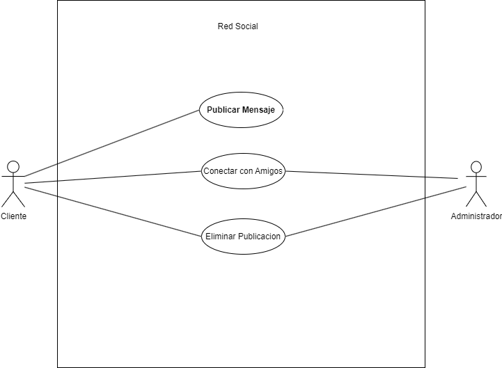

Actor| Usuario
|---|---|
Descripción| Individuo registrado en la aplicación de red social.
Características| Capacidad para interactuar en la plataforma con otros usuarios, comunicarse y compartir mensajes.
Relaciones| Posibilidad de entablar interacciones con otros usuarios dentro de la red social.
Referencias| Puede realizar acciones como publicar mensajes, conectarse con amigos y eliminar publicaciones.
Notas| El perfil del usuario puede contener elementos como el número de amigos, publicaciones con "me gusta", elementos guardados o marcados como favoritos.
| Autor  | Joseph Vanegas Caicedo |
|Fecha | 30/01/2024 |

Actor| Administrador
|---|---|
Descripción| Usuario con privilegios especiales encargado de gestionar y moderar la plataforma de la red social.
Características| Capacidad para moderar y modificar el contenido, así como acceso a los aspectos técnicos del sistema de la red social.
Relaciones| Interacción con los usuarios y sus publicaciones.
Referencias| Responsable de moderar el contenido, eliminando las publicaciones que no cumplan con las normas establecidas.
Notas| Acceso privilegiado a funciones y datos confidenciales dentro de la plataforma.
| Autor  | Joseph Vanegas Caicedo |
|Fecha | 30/01/2024 |

Caso de Uso|	Publicar Mensaje
|---|---|
Fuentes| Aplicación de Red Social
Actor| Usuario
Descripción| Los usuarios pueden escribir mensajes de texto y compartirlos en la plataforma, permitiendo que sus amigos los vean.
Flujo Básico| Iniciar la aplicación. Ir a la sección de escribir publicación. Escribir el mensaje. Opcionalmente, insertar imágenes. Pulsar el botón de enviar.
Pre-condiciones| Iniciar sesión en la aplicación.
Post-condiciones| El mensaje se publica y puede ser visto por otros usuarios.
Requerimientos| Conexión a Internet.
Notas| Los usuarios pueden configurar opciones de privacidad para la publicación y etiquetar a amigos.
| Autor  | Joseph Vanegas Caicedo |
|Fecha | 30/01/2024 |

Caso de Uso	|Conectar con Amigos
|---|---|
Fuentes	|Aplicación de Red Social
Actor	|Usuario
Descripción |	Permite al usuario añadir amigos y enviarles mensajes privados.
Flujo Básico|	1. El usuario busca a un amigo por su nombre de usuario. 2. Envía una solicitud de amistad. 3. El otro usuario acepta la solicitud.
Pre-condiciones|	Ambos usuarios deben estar registrados en la aplicación.
Post-condiciones|	Se establece contacto y comunicación entre los usuarios.
Requerimientos|	Conexión a Internet.
Notas|	El usuario que recibe la solicitud puede rechazarla si así lo desea.
| Autor  | Joseph Vanegas Caicedo |
|Fecha | 30/01/2024 |

Caso de Uso|	Eliminar Publicación|
|---|---|
Fuentes|	Aplicación de Red Social
Actor|	Administrador, Usuario
Descripción	|La aplicación permite al administrador eliminar publicaciones de usuarios que infringen las normas de la plataforma. También permite al usuario borrar sus propios mensajes cuando así lo decida.
Flujo Básico|	1. Acceder a la aplicación. 2. Seleccionar la publicación que se desea borrar. 3. Pulsar la opción de eliminar.
Pre-condiciones	| Iniciar sesión en la cuenta. - Para el administrador, tener permisos de gestión del contenido de otros usuarios.
Post-condiciones|	La publicación seleccionada se elimina del sistema.
Requerimientos	|Conexión a Internet. Para el administrador, se requieren permisos específicos adicionales.
Notas|	Las opciones de reportar publicaciones permiten a los administradores decidir si eliminarlas.
| Autor  | Joseph Vanegas Caicedo |
|Fecha | 30/01/2024 |