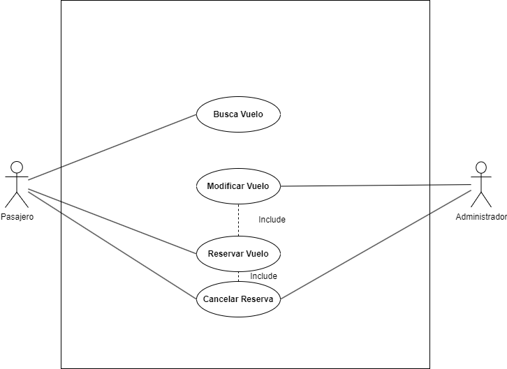

|Actor	|Pasajero|
|Descripción|	El usuario utiliza el sistema de reservas de vuelos para buscar, reservar y gestionar vuelos.|
|---|---|
|Características	| Busca vuelos según fechas, precios, descuentos especiales, etc. - Puede realizar reservas y cancelarlas.|
|Relaciones	|Mediante un agente, puede modificar la reserva o cancelarla.|
|Referencias|	Buscar Vuelo, Reservar Vuelo, Cancelar Reserva.|
|Notas|	Preferencias de tipo de equipaje y asiento, y puede tener necesidades especiales.|
| Autor  | Joseph Vanegas Caicedo |
|Fecha | 30/01/2024 |

|Actor	|Agente de Reservas|
|---|---|
|Descripción|	Persona que trabaja en el sistema de reservas de vuelos con capacidad para cancelar vuelos y modificar reservas en el sistema.|
|Características|	- Acceso a la base de datos de las reservas y gestión de estas con los datos de los pasajeros. - Puede cancelar reservas.|
|Relaciones|	Con el pasajero, al gestionar las reservas.|
|Referencias|	Gestión de reservas, Cancelar Reserva.|
|Notas|	Acceso y permiso de edición en el sistema de reservas.|
| Autor  | Joseph Vanegas Caicedo |
|Fecha | 30/01/2024 |

|Caso de Uso|	Buscar Vuelo
|---|---|
|Fuentes	|Sistema de reservas de vuelos
|Actor	|Pasajero|
|Descripción|	El cliente tiene la capacidad de buscar vuelos disponibles según diferentes criterios.|
|Flujo básico|	1. El usuario accede a la sección de búsqueda de vuelos. 2. Ingresa criterios como fecha, destino, etc. 3. Obtiene resultados de búsqueda.|
|Pre-condiciones|	No se requiere información específica previa.|
|Post-condiciones|	El usuario puede visualizar una lista de vuelos que coinciden con los criterios de búsqueda.|
|Requerimientos|	Se necesita una conexión a Internet para acceder a la base de datos de vuelos.|
|Notas|	Los usuarios pueden elegir entre distintas tarifas de precio según si son residentes o pertenecen a una familia numerosa.|
| Autor  | Joseph Vanegas Caicedo |
|Fecha | 30/01/2024 |

|Caso de Uso|	Reservar Vuelo|
|---|---|
|Fuentes|	Sistema de reservas de vuelos|
|Actor|	Pasajero|
|Descripción|	Permite al pasajero reservar un vuelo encontrado en la búsqueda.|
|Flujo básico|	1. El usuario selecciona un vuelo y rellena con sus datos necesarios los campos requeridos. 2. Confirma la reserva.|
|Pre-condiciones|	El usuario ha encontrado un vuelo que quiere reservar.|
|Post-condiciones|	El sistema registra la reserva asociada al pasajero.|
|Requerimientos|	Disponibilidad del vuelo e información del pasajero.|
|Notas|	Se puede proporcionar la opción de elegir asientos, seguro de viaje y opciones de equipaje.|
| Autor  | Joseph Vanegas Caicedo |
|Fecha | 30/01/2024 |

|Caso de Uso|	modificar Vuelo|
|---|---|
|Fuentes|	Sistema de reservas de vuelos|
|Actor|	Agente de Reservas|
|Descripción	|El agente de reservas busca y gestiona reservas en nombre de los pasajeros.|
|Flujo básico|	1. El agente accede a la base de datos de reservas. 2. Busca y selecciona la reserva deseada. 3. Realiza acciones como modificar detalles o verificar el estado de la reserva.|
|Pre-condiciones|	El agente tiene permisos de edición de reserva.|
|Post-condiciones|	La reserva se actualiza de acuerdo a los cambios realizados por el agente.|
|Requerimientos|	Se requiere conexión a Internet para acceder a la base de datos de reservas.|
|Notas|	Se considera si la reserva debe ser modificada o no.|
| Autor  | Joseph Vanegas Caicedo |
|Fecha | 30/01/2024 |

|Caso de Uso|	Cancelar Reservas|
|---|---|
|Fuentes|	Sistema de reservas de vuelos|
|Actor|	Agente de Reservas, Pasajero|
|Descripción	|Permite al agente de reservas o al pasajero cancelar una reserva existente.
|Flujo básico	1. Acceder al apartado de gestión de reservas. 2. Seleccionar y confirmar la cancelación de la reserva.|
|Pre-condiciones|	Existencia previa de una reserva en el sistema.|
|Post-condiciones|	La reserva se marca como cancelada en el sistema.|
|Requerimientos	|Permiso de cancelación autorizado.|
|Notas|	Se aplican políticas de cancelación y pueden existir cargos o reembolsos.|
|Autor|	Joseph Vanegas Caicedo|
|Fecha|	30/01/2024|