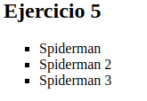

# Tarea1 Listas

## Ejercicio 1

### Haz una lista ordenada de los cinco primeros países que vas a visitar en los próximos años. En la lista ordenada usarás números.
 
```html
<!DOCTYPE html>
<html>
<body>
<h2>Ejercicio 1</h2>

<ol>
  <li>Japon</li>
  <li>Sur Korea</li>
  <li>Pakistan</li>
  <li>Australia</li>
  <li>Reino Unido</li>
</ol>  
</body>
</html>
```


## Ejercicio 2
### Utilizando la lista anterior, invierte el orden de los números. Pista: reversed

```html
<!DOCTYPE html>
<html>
<body>
<h2>Ejercicio 2</h2>

<ol reversed>
    <li>Japon</li>
    <li>Sur Korea</li>
    <li>Pakistan</li>
    <li>Australia</li>
    <li>Reino Unido</li>
  </ol>  
</body>
</html>
```


## Ejercicio 3
### Haz una lista ordenada con letras en mayúscula de tus comidas favoritas. Pista: type A

```html
<!DOCTYPE html>
<html>
<body>
<h2>Ejercicio 3</h2>
<ol type="A">
  <li>Pizza</li>
  <li>Tteokbokki</li>
  <li>Pollo frito</li>
</ol> 
</body>
</html>
```


## Ejercicio 4
### Utilizando la lista ordenada del ejercicio 3, ahora ordena tus comidas favoritas con números romanos en mayúscula.Pista: type l

```html
<!DOCTYPE html>
<html>
<body>
<h2>Ejercicio 4</h2>
<ol type="I">
  <li>Pizza</li>
  <li>Tteokbokki</li>
  <li>Pollo frito</li>
</ol> 
</body>
</html>
```


## Ejercicio 5
### Haz una lista desordenada de tus películas favoritas. Utilizarás para el estilo de la lista cuadraditos negros.Pista: Type square

```html
<!DOCTYPE html>
<html>
<body>
<h2>Ejercicio 5</h2>
<ul type="square">
  <li>Spiderman</li>
  <li>Spiderman 2</li>
  <li>Spiderman 3</li>
</ul> 
</body>
</html>
```


## Ejercicio 6
### Usando como ejemplo la lista desordenada del ejercicio 5, ahora utiliza como estilode la lista puntos o circulitos negros. Pista: type disk

```html
<!DOCTYPE html>
<html>
<body>
<h2>Ejercicio 6</h2>
<ul type="disk">
  <li>Spiderman</li>
  <li>Spiderman 2</li>
  <li>Spiderman 3</li>
</ul> 
</body>
</html>
```


## Ejercicio 7
### Haz una lista anidada de ciudades que quieres visitar en los próximos cinco años de al menos tres países distintos.

```html
<!DOCTYPE html>
<html>
<body>
<h2>Ejercicio 7</h2>
<ul>
  <li>America</li>
  <li>Japon
    <ul>
      <li>Tokyo</li>
      <li>Kyoto</li>
    </ul>
  </li>
  <li>Pakitan</li>
</ul>
</body>
</html>
```

