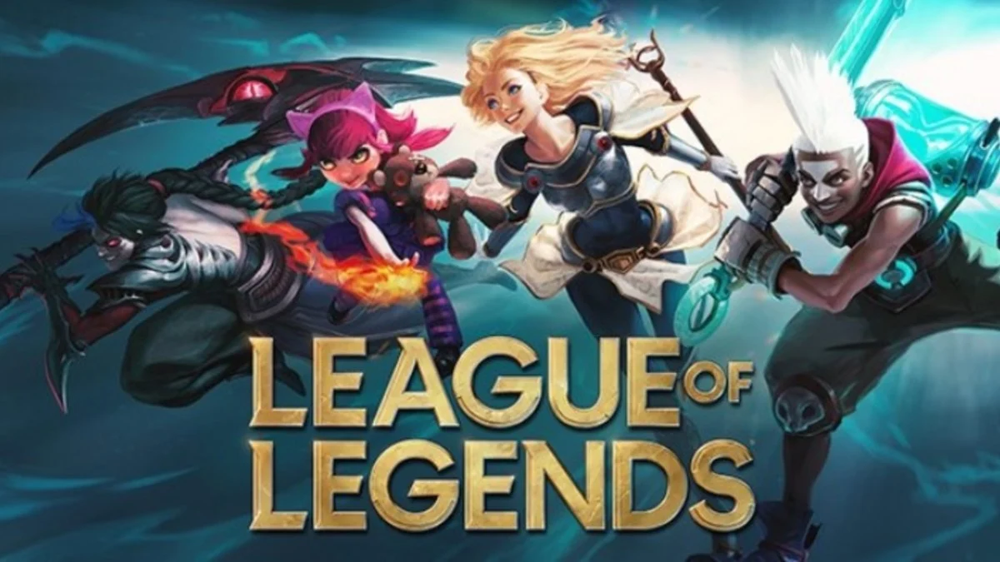

# 

### League of legends es un juego estilo MOBA(Videojuego multijugador de arena de batalla en línea) que fue lanzado 2009 por una compañia llamada riot.

### En League of legend puedes elegir variedad de personajes como:

- [Yasuo](https://leagueoflegends.fandom.com/wiki/Yasuo)


- [Fiddlesticks](https://leagueoflegends.fandom.com/wiki/Fiddlesticks)


- [Warwick](https://leagueoflegends.fandom.com/wiki/Warwick)


>Se necesita un monstruo para matar a otro.

- [Caitlyn](https://leagueoflegends.fandom.com/wiki/Caitlyn)


- [Senna](https://leagueoflegends.fandom.com/wiki/Senna)


- [Cho'Gath](https://leagueoflegends.fandom.com/wiki/Cho'Gath)


Roles
1. Top
2. Mid
3. Jungle
4. Bot
5. Support

### Desventajas
* [X] Gastas mucho tiempo
* [X] Poco intuitivo para los principiantes

### Ventajas
* [X] Divertido

<a href="https://www.youtube.com/watch?v=PkSES7B9IZE">

```
Este es el final
```

